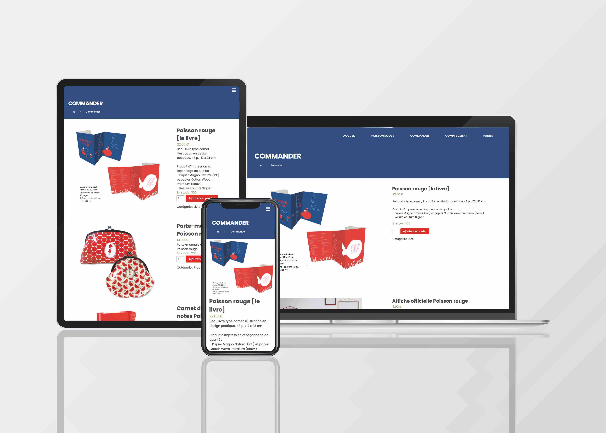
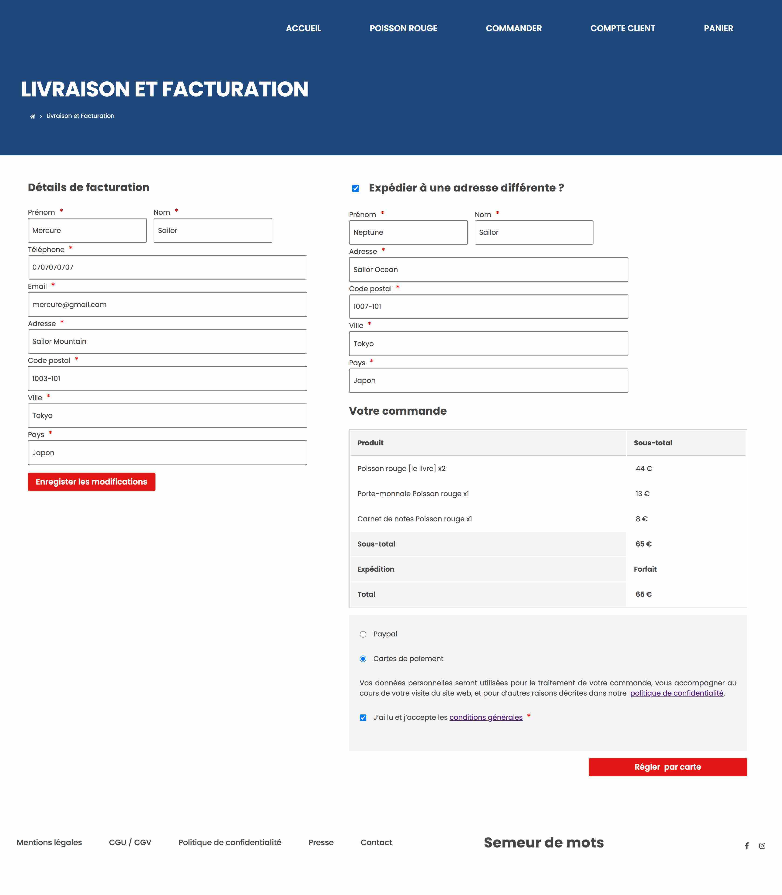
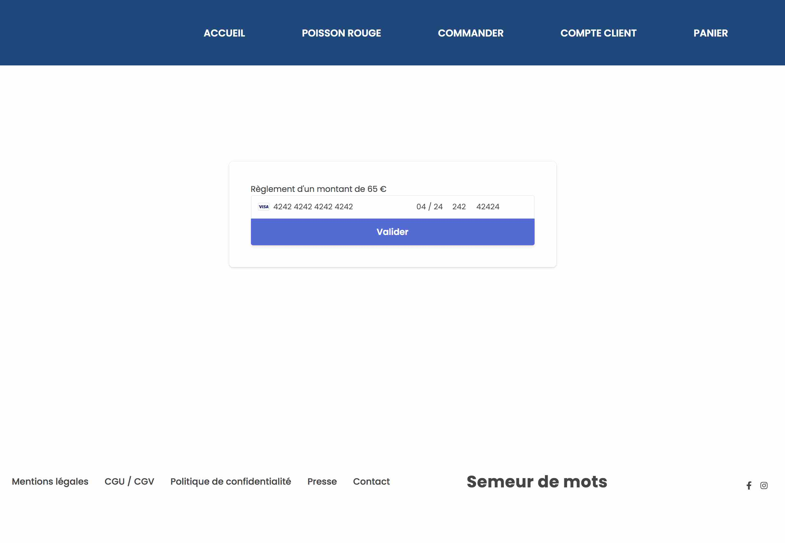
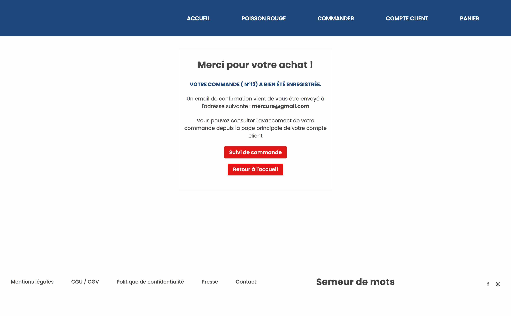
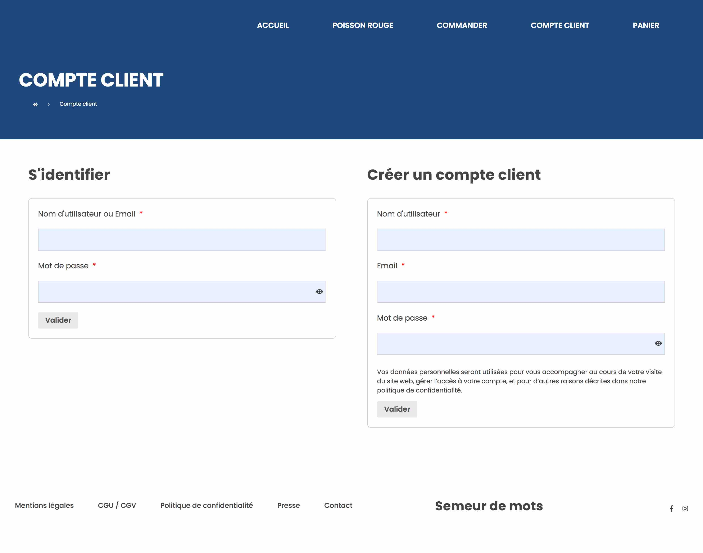
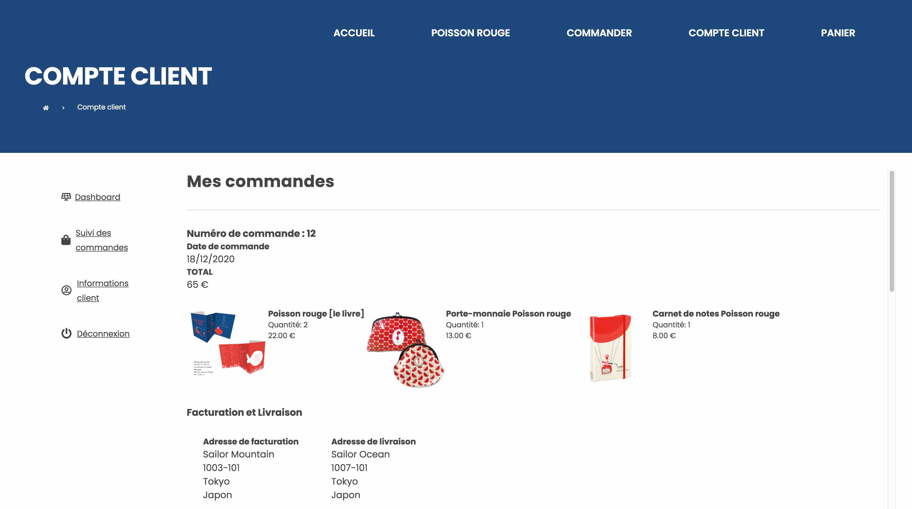
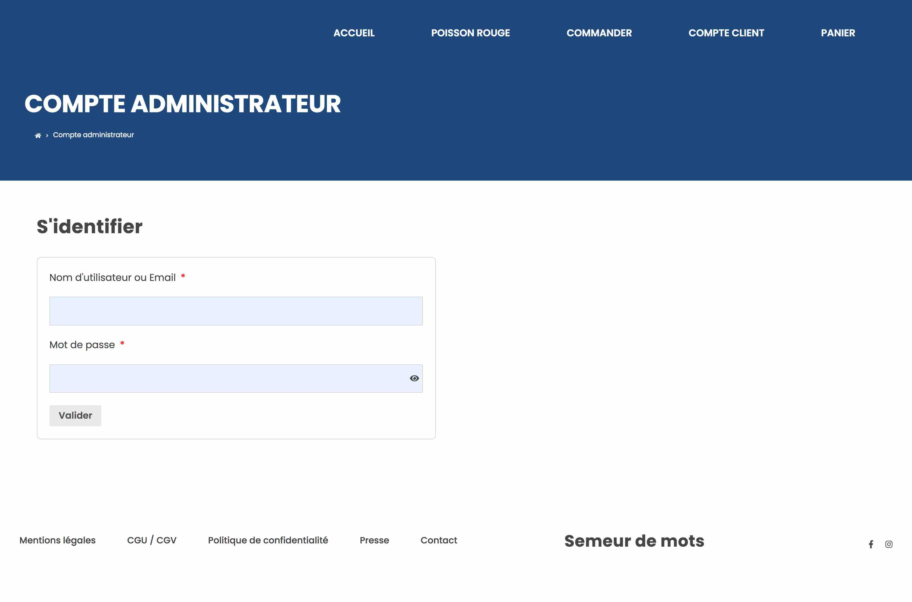
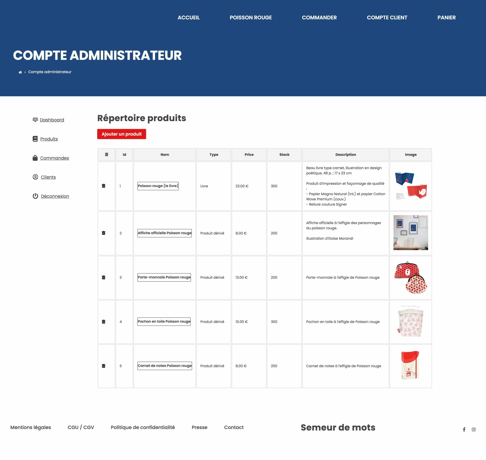
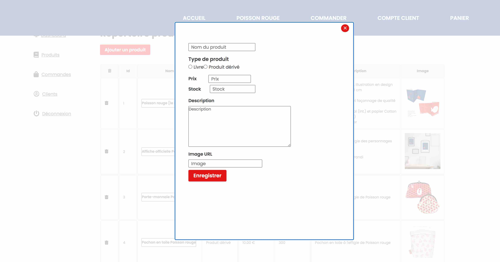

# semeurdemots_client

[REACT.JS] Client-side application - Project "Semeur de Mots"

:books: Project "Semeur de mots" :books:
The online store of a French independant publishing house.

:construction: Upcoming editorial sections :construction:

Tech stack: React.js, SASS, Stripe

:link: upcoming

### Store / Boutique

### Checkout / Facturation & Livraison

### Payment / Paiement (via Stripe)

### Confirmation

### Customer Signup & Signin / Inscription & Connexion

### Customer Portal Order Tracking / Portail client suivi de commande

### Admin Signup & Signin / Connexion administrateur

### Admin Portal Product Listing - Back-office / Portail administrateur listing et ajout produits

